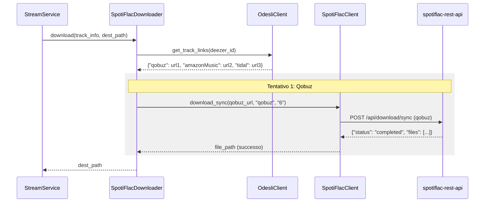

# Specifica di Design: Integrazione SpotiFLAC Downloader

*   **Stato**: Approvato (in attesa di revisione finale della specifica)
*   **Data**: 2026-07-16
*   **Autore**: Antigravity & Michele
*   **Argomento**: Aggiunta del downloader SpotiFLAC nella catena di download di Rivo-Drome

---

## 1. Contesto e Obiettivo

Il proxy Subsonic **Rivo-Drome** utilizza una catena di responsabilità (`BaseDownloader`) per scaricare on-demand le tracce non presenti su disco. Attualmente la catena supporta Torrent (`TorrentDownloader`) e YouTube (`YoutubeDownloader`).

Questo documento descrive il design per un nuovo downloader nella catena, **SpotiFLAC**, che consente il download in alta qualità (FLAC o MP3) tramite l'integrazione con il servizio locale `spotiflac-rest-api`. 

Il flusso prevede di:
1.  Ottenere i link del brano per **Qobuz**, **Amazon Music** e **Tidal** tramite l'API pubblica di **Odesli (Songlink)** a partire dal `deezer_id` del brano.
2.  Chiamare sequenzialmente l'API locale `spotiflac-rest-api` per ciascun servizio (Qobuz, poi Amazon Music, infine Tidal) fino a quando un download non va a buon fine.
3.  Salvare il file scaricato sul disco locale.

---

## 2. Dettaglio dei Componenti

### 2.1 SpotiFlacConfig
Classe di configurazione che estrae dal file `.env` i parametri per l'interazione con `spotiflac-rest-api`:
*   `SPOTIFLAC_API_URL`: L'indirizzo URL del server (default: `http://localhost:8080`).
*   `SPOTIFLAC_USERNAME`: Credenziale per eventuale autenticazione (opzionale, default: `None`).
*   `SPOTIFLAC_PASSWORD`: Credenziale per eventuale autenticazione (opzionale, default: `None`).

### 2.2 OdesliClient
Client HTTP per interagire con l'API di Odesli (Songlink):
*   **Endpoint**: `GET https://api.odesli.co/v1/links?url=https://www.deezer.com/track/{deezer_id}&userCountry=IT`
*   **Funzionalità**: Riceve il `deezer_id` della traccia, costruisce l'URL di Deezer e interroga Odesli per ottenere i link delle piattaforme Qobuz, Tidal e Amazon Music.
*   **Output**: Dizionario con i link risolti:
    ```python
    {
        "qobuz": Optional[str],
        "tidal": Optional[str],
        "amazonMusic": Optional[str]
    }
    ```

### 2.3 SpotiFlacClient
Client HTTP che interagisce con l'API locale `spotiflac-rest-api`:
*   **Endpoint**: `POST {SPOTIFLAC_API_URL}/api/download/sync`
*   **Payload JSON**:
    ```json
    {
      "url": "{PLATFORM_URL}",
      "service": "{qobuz|tidal|amazon}",
      "quality": "{quality_code}",
      "output_dir": "{temp_dir}"
    }
    ```
    *Nota: Per Amazon Music il servizio nel payload di SpotiFLAC si chiama `"amazon"`, mentre su Odesli è `"amazonMusic"`.*
*   **Funzionalità**: Avvia il download in modalità sincrona. Quando l'API risponde con successo, restituisce il percorso locale del file scaricato temporaneamente.

### 2.4 SpotiFlacDownloader
Classe che implementa `BaseDownloader` per integrarsi nella catena dei downloader:
*   Riceve le dipendenze `OdesliClient` e `SpotiFlacClient` tramite `@inject` nel costruttore.
*   **Integrazione in TrackInfo**: Viene aggiunto il campo `deezer_id: Optional[int] = None` alla classe `TrackInfo` per consentire al downloader di accedere al riferimento Deezer.
*   **Metodo `_do_download(self, track_info: TrackInfo, dest_path: str) -> Optional[str]`**:
    1.  Verifica la presenza di `track_info.deezer_id`. Se non è presente, fallisce immediatamente restituendo `None`.
    2.  Richiede a `OdesliClient` i link per il brano.
    3.  Tenta il download in sequenza per le piattaforme disponibili:
        *   **Qobuz**: se presente il link, chiama `SpotiFlacClient.download_sync(url, "qobuz", "6")`.
        *   **Amazon**: se presente il link, chiama `SpotiFlacClient.download_sync(url, "amazon", "")`.
        *   **Tidal**: se presente il link, chiama `SpotiFlacClient.download_sync(url, "tidal", "LOSSLESS")`.
    4.  Se uno dei tentativi restituisce un file scaricato:
        *   Sposta/rinomina il file in `dest_path`.
        *   Ritorna `dest_path`.
    5.  Se tutti i tentativi falliscono, ritorna `None` (permettendo il passaggio al downloader successivo nella catena).

---

## 3. Flusso dei Dati

Il flusso d'interazione segue lo schema seguente:



---

## 4. Integrazione nel Container

Nel file `DefaultContainer` (`rivo_drome/container/default_container.py`):
1.  Verrà istanziata `SpotiFlacConfig` e registrata nel binder dell'iniettore.
2.  I client `OdesliClient` e `SpotiFlacClient` non richiedono parametri letterali (a parte le classi di configurazione/altri client che verranno risolti implicitamente tramite `@inject`), quindi verranno risolti automaticamente senza binding esplicito nel container, in conformità con le linee guida del progetto.
3.  Verrà inserito il supporto a `"spotiflac"` all'interno dell'inizializzazione della catena di downloader leggendo la variabile d'ambiente `DOWNLOADER_CHAIN`.

Esempio di sequenza della catena in `.env`:
```bash
DOWNLOADER_CHAIN=spotiflac,torrent,youtube
```

---

## 5. Gestione degli Errori e Casi Limite

*   **Odesli non risponde o dà errore**: Il client gestisce l'eccezione loggando l'errore e restituendo un dizionario vuoto. Il downloader passerà al servizio successivo o al downloader successivo della catena.
*   **Link non trovato**: Se Odesli non restituisce il link per una specifica piattaforma (es. brano non presente su Qobuz), il downloader salta quella piattaforma e prova la successiva.
*   **Qualità del file**: Di default si utilizzerà la qualità lossless `"6"` per Qobuz, `"LOSSLESS"` per Tidal, e nessuna specifica di qualità (o default) per Amazon, come indicato dalle specifiche dell'API.
