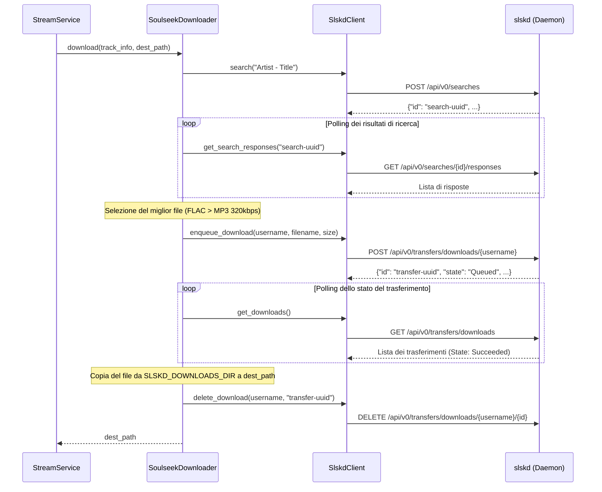

# Specifica di Design: Integrazione Soulseek Downloader (slskd)

*   **Stato**: In attesa di approvazione finale
*   **Data**: 2026-07-18
*   **Autore**: Antigravity & Michele
*   **Argomento**: Aggiunta del downloader Soulseek nella catena di download di Rivo-Drome tramite integrazione con il daemon `slskd`

---

## 1. Contesto e Obiettivo

Il proxy Subsonic **Rivo-Drome** utilizza una catena di responsabilità (`BaseDownloader`) per scaricare on-demand le tracce non presenti su disco. Attualmente la catena supporta Torrent, YouTube e SpotiFLAC.

Questo documento descrive il design per integrare nella catena un nuovo downloader, **Soulseek**, che consente il download in alta qualità (FLAC o MP3) tramite l'integrazione con l'API del servizio locale **`slskd`** (Soulseek Daemon).

Il flusso previsto prevede di:
1.  Interrogare `slskd` per avviare una ricerca asincrona basata sulla stringa `"Artista - Titolo"` del brano.
2.  Effettuare il polling dei risultati per un tempo massimo prefissato, selezionando il file migliore in base a criteri di qualità (FLAC prima, poi MP3 320kbps).
3.  Accodare il download del file scelto su `slskd`.
4.  Monitorare lo stato del download fino al completamento (`Succeeded`), gestendo eventuali code o timeout.
5.  Recuperare il file dalla cartella condivisa del host, copiarlo/rinominarlo nella cartella di destinazione di Rivo-Drome, e pulire la cronologia di `slskd`.

---

## 2. Dettaglio dei Componenti e Configurazione

### 2.1 Modifiche alle Variabili d'Ambiente (.env)
Verranno introdotte le seguenti variabili nel file `.env` di Rivo-Drome per gestire l'integrazione in modo agnostico e permettere a Rivo-Drome di mappare le cartelle necessarie:

```bash
# Abilitazione di Soulseek nella catena (es. prima scelta)
DOWNLOADER_CHAIN=soulseek,spotiflac,torrent,youtube

# Configurazione API slskd
SLSKD_API_URL=http://localhost:5030
SLSKD_API_KEY=your_slskd_api_key

# Directory di scambio file (Host vs Container)
# 1. Navidrome Music
NAVIDROME_MUSIC_HOST_DIR=/Users/michele/PycharmProjects/navidrome/music
NAVIDROME_MUSIC_DIR=/app/var/navidrome_music

# 2. Soulseek Downloads
SLSKD_DOWNLOADS_HOST_DIR=/Users/michele/PycharmProjects/slskd/downloads
SLSKD_DOWNLOADS_DIR=/app/var/slskd/downloads

# Timeout e tolleranze di rete
SLSKD_SEARCH_TIMEOUT=10
SLSKD_DOWNLOAD_TIMEOUT=60
```

### 2.2 docker-compose.yml di Rivo-Drome
Nel file `docker-compose.yml` del proxy Rivo-Drome verranno mappati i volumi dinamici per permettere al container Rivo-Drome di accedere direttamente alle cartelle di Navidrome e di `slskd`:

```yaml
  proxy:
    ...
    volumes:
      - .:/app
      - ${NAVIDROME_MUSIC_HOST_DIR}:${NAVIDROME_MUSIC_DIR}
      - ${SLSKD_DOWNLOADS_HOST_DIR}:${SLSKD_DOWNLOADS_DIR}
```

### 2.3 SlskdConfig
Classe di configurazione (`rivo_drome/config/slskd_config.py`) che estrae dal file `.env` i parametri per l'interazione con `slskd`:
*   `api_url`: Indirizzo del server `slskd` (default: `http://localhost:5030`).
*   `api_key`: Chiave di autenticazione per l'API.
*   `downloads_dir`: Cartella locale nel container in cui trovare i file scaricati (mappata su `SLSKD_DOWNLOADS_DIR`).
*   `search_timeout`: Tempo massimo di attesa per la ricerca (default: `10`).
*   `download_timeout`: Tempo massimo di attesa per il download (default: `60`).

### 2.4 SlskdClient
Client HTTP (`rivo_drome/client/slskd_client.py`) che interagisce con l'API di `slskd`:
*   Richiega l'header `X-API-Key` per tutte le chiamate.
*   `async def search(self, query: str) -> str`: Esegue `POST /api/v0/searches` con payload `{"searchText": query}`. Restituisce il UUID della ricerca.
*   `async def get_search_responses(self, search_id: str) -> List[dict]`: Esegue `GET /api/v0/searches/{search_id}/responses` per ottenere i risultati accumulati.
*   `async def delete_search(self, search_id: str) -> None`: Esegue `DELETE /api/v0/searches/{search_id}` per pulire le ricerche effettuate.
*   `async def enqueue_download(self, username: str, filename: str, size: int) -> dict`: Esegue `POST /api/v0/transfers/downloads/{username}` con payload `{"filename": filename, "size": size}`. Restituisce il dizionario del trasferimento (con ID).
*   `async def get_downloads(self) -> List[dict]`: Esegue `GET /api/v0/transfers/downloads` per monitorare la lista dei trasferimenti attivi.
*   `async def delete_download(self, username: str, transfer_id: str) -> None`: Esegue `DELETE /api/v0/transfers/downloads/{username}/{transfer_id}` per rimuovere il record del trasferimento.

### 2.5 SoulseekDownloader
Classe (`rivo_drome/service/downloader/soulseek_downloader.py`) che implementa `BaseDownloader`:
*   Riceve `SlskdClient` e `SlskdConfig` nel costruttore tramite `@inject`.
*   **Metodo `_do_download(self, track_info: TrackInfo, dest_path: str) -> Optional[str]`**:
    1.  Avvia la ricerca per `"Artist - Title"`.
    2.  Effettua polling asincrono su `get_search_responses` ogni 2 secondi per max `search_timeout`.
    3.  Seleziona il file ottimale (priorità a `.flac` con alto bitrate, poi `.mp3` preferibilmente a 320kbps).
    4.  Avvia il download tramite `enqueue_download`.
    5.  Effettua polling su `get_downloads` ogni 3 secondi per max `download_timeout`.
        *   Stato `"Succeeded"`: download completato con successo.
        *   Stato `"Errored"`, `"Cancelled"`, `"TimedOut"`, `"Aborted"`: download fallito.
    6.  Se completato:
        *   Localizza il file in `SLSKD_DOWNLOADS_DIR/filename` (normalizzando le barre `\` in `/` e risolvendo percorsi relativi).
        *   Copia/sposta il file in `dest_path`.
        *   Pulisce le risorse con `delete_search` e `delete_download`.
        *   Restituisce `dest_path`.
    7.  Se fallito, annullato o in timeout:
        *   Chiama `delete_download` per annullare la coda.
        *   Ritorna `None` per passare al downloader successivo.

---

## 3. Flusso dei Dati

L'interazione dei componenti segue lo schema seguente:



---

## 4. Integrazione nel Container Dependency Injection

Nel file `DefaultContainer` (`rivo_drome/container/default_container.py`):
1.  Verrà istanziata `SlskdConfig` configurata con i valori d'ambiente letti in `_init_environment_variables` (es. `SLSKD_API_URL`, `SLSKD_API_KEY`, `SLSKD_DOWNLOADS_DIR`, `SLSKD_SEARCH_TIMEOUT`, `SLSKD_DOWNLOAD_TIMEOUT`).
2.  Verranno registrati i binding necessari per `SlskdConfig`.
3.  Verrà inserito il supporto a `"soulseek"` all'interno dell'inizializzazione della catena di downloader leggendo la variabile `DOWNLOADER_CHAIN`.

---

## 5. Gestione degli Errori e Casi Limite

*   **Timeout di scaricamento o blocco in Coda**: Se il download rimane nello stato di coda (o in download estremamente lento) superando `SLSKD_DOWNLOAD_TIMEOUT` secondi, Rivo-Drome interrompe il polling, cancella la richiesta su `slskd` inviando una `DELETE` sul trasferimento specifico e ritorna `None`.
*   **Normalizzazione dei percorsi**: Le barre retroverse Windows (`\`) contenute nei nomi dei file restituiti da Soulseek verranno convertite in barre normali (`/`) per allinearsi al filesystem Unix in cui gira `slskd` e Rivo-Drome.
*   **slskd non raggiungibile**: Se `SlskdClient` fallisce la chiamata HTTP a causa di problemi di rete o servizio spento, viene intercettata l'eccezione, loggato un warning e il downloader ritorna immediatamente `None`, garantendo la massima stabilità di Rivo-Drome.
