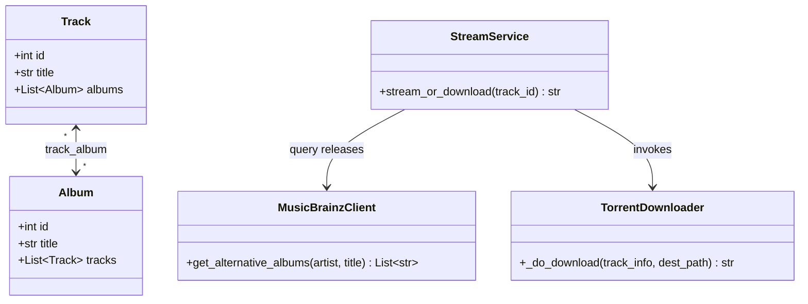

# Spec di Progettazione: Integrazione MusicBrainz e Relazione Many-to-Many

Questo documento descrive il design tecnico per integrare un client MusicBrainz in Rivo-Drome. L'obiettivo è individuare album alternativi (es. compilation, album in studio) in cui compare una determinata traccia (per evitare che la ricerca si areni sui singoli, spesso non presenti su torrent) e aggiornare la relazione tra Traccia ed Album a Many-to-Many.

---

## 1. Obiettivi e Requisiti

* **MusicBrainz Client**: Interrogare le API pubbliche di MusicBrainz per trovare tutti gli album (releases) contenenti una specifica canzone.
* **Risoluzione Deezer**: Per ciascun album alternativo trovato, cercarlo su Deezer per ottenerne il `deezer_id` e la copertina. Se non trovato, scartarlo.
* **Relazione Many-to-Many**: Consentire a una traccia di essere associata a molteplici album (un album principale da Deezer e diversi album alternativi da MusicBrainz).
* **Jackett Search**: Estendere la catena di download affinché cerchi su Jackett l'album principale, poi i primi 5 album alternativi, ed infine la traccia singola como fallback.

---

## 2. Modifiche al Database

Poiché il progetto è in fase iniziale, modificheremo direttamente i file di definizione e migrazione esistenti senza creare migrazioni incrementali complesse.

### Tabella di Associazione `track_album`
Aggiungeremo una tabella di associazione intermedia per mappare la relazione Many-to-Many tra [Track](file:///Users/michele/PycharmProjects/rivo-drome/rivo_drome/entity/track.py) e [Album](file:///Users/michele/PycharmProjects/rivo-drome/rivo_drome/entity/album.py).

Nel file di migrazione [003_track.py](file:///Users/michele/PycharmProjects/rivo-drome/alembic/versions/003_track.py):
* Rimuoveremo la colonna `album_id` e la relativa Foreign Key constraint dalla tabella `track`.
* Creeremo la tabella `track_album`:
  ```sql
  CREATE TABLE track_album (
      track_id INT NOT NULL,
      album_id INT NOT NULL,
      PRIMARY KEY (track_id, album_id),
      FOREIGN KEY (track_id) REFERENCES track(id) ON DELETE CASCADE,
      FOREIGN KEY (album_id) REFERENCES album(id) ON DELETE CASCADE
  );
  ```

---

## 3. Componenti Software e Relazioni



### 3.1 Entità SQLAlchemy
* Creazione del file [rivo_drome/entity/track_album.py](file:///Users/michele/PycharmProjects/rivo-drome/rivo_drome/entity/track_album.py) per la tabella di associazione:
  ```python
  from sqlalchemy import Table, Column, Integer, ForeignKey
  from rivo_drome.entity.base import BaseEntity

  track_album = Table(
      "track_album",
      BaseEntity.metadata,
      Column("track_id", Integer, ForeignKey("track.id", ondelete="CASCADE"), primary_key=True),
      Column("album_id", Integer, ForeignKey("album.id", ondelete="CASCADE"), primary_key=True),
  )
  ```
* In [Track](file:///Users/michele/PycharmProjects/rivo-drome/rivo_drome/entity/track.py):
  * Rimozione del campo `album_id`.
  * Aggiunta della relazione:
    ```python
    albums = relationship("Album", secondary=track_album, back_populates="tracks")
    ```
* In [Album](file:///Users/michele/PycharmProjects/rivo-drome/rivo_drome/entity/album.py):
  * Aggiornamento della relazione `tracks`:
    ```python
    tracks = relationship("Track", secondary=track_album, back_populates="albums")
    ```

### 3.2 Repository
Aggiornamento di [TrackRepository](file:///Users/michele/PycharmProjects/rivo-drome/rivo_drome/repository/track_repository.py):
* Modificare `_find_by_album_sync` per eseguire una query con `join`:
  ```python
  def _find_by_album_sync(self, album_id: int) -> List[Track]:
      with self._db_manager.create_session() as session:
          return (
              session.query(Track)
              .join(Track.albums)
              .filter(Album.id == album_id)
              .order_by(Track.track_number)
              .all()
          )
  ```

---

## 4. Flusso Logico di Download e Risoluzione

### 4.1 MusicBrainzClient
Creazione del client [MusicBrainzClient](file:///Users/michele/PycharmProjects/rivo-drome/rivo_drome/client/musicbrainz_client.py):
* **Endpoint**: `https://musicbrainz.org/ws/2/recording`
* **Query**: `query=recording:"{track_title}" AND artist:"{artist_name}"&fmt=json`
* **Limiti**: User-Agent specifico valorizzato in configurazione (es. `RivoDrome/1.0.0 (contact@example.com)`).
* **Output**: Ritorna al massimo 5 titoli di album univoci associati alle registrazioni trovate.

### 4.2 StreamService
Nel metodo `stream_or_download` di [StreamService](file:///Users/michele/PycharmProjects/rivo-drome/rivo_drome/service/stream_service.py):
1. Prima di procedere con la chiamata alla catena dei downloader:
   * Esegue la ricerca tramite `MusicBrainzClient`.
   * Per ciascun album identificato, interroga `DeezerClient.search_album`.
   * Se l'album è trovato su Deezer, lo salva/recupera nel database e lo appende a `track.albums` (salvando la sessione tramite `track_repository.save`).
2. Genera il [TrackInfo](file:///Users/michele/PycharmProjects/rivo-drome/rivo_drome/model/track_info.py) aggiungendo la lista dei titoli degli album alternativi associati alla traccia nel DB nel nuovo attributo `alternative_albums`.

### 4.3 TorrentDownloader
In [TorrentDownloader](file:///Users/michele/PycharmProjects/rivo-drome/rivo_drome/service/downloader/torrent_downloader.py), aggiorniamo la composizione delle query:
* Cerchiamo su Jackett con le seguenti query in sequenza, fermandoci al primo match che restituisce torrent:
  1. `{artist} {album_principale}` (se presente)
  2. `{artist} {album_alternativo_1}`
  3. ...
  4. `{artist} {album_alternativo_5}`
  5. `{artist} - {track_title}` (fallback)

---

## 5. Piano di Test e Validazione

* **Unit Test**:
  * Testare [MusicBrainzClient](file:///Users/michele/PycharmProjects/rivo-drome/rivo_drome/client/musicbrainz_client.py) mockando la risposta JSON delle API MusicBrainz.
  * Testare il comportamento di risoluzione degli album alternativi in [StreamService](file:///Users/michele/PycharmProjects/rivo-drome/rivo_drome/service/stream_service.py).
  * Validare il corretto funzionamento della relazione Many-to-Many nel database tramite test integrati con SQLite/MariaDB di test.
* **Integrazione**:
  * Verificare che il comando CLI di download interroghi correttamente MusicBrainz e provi le query alternative in sequenza.
